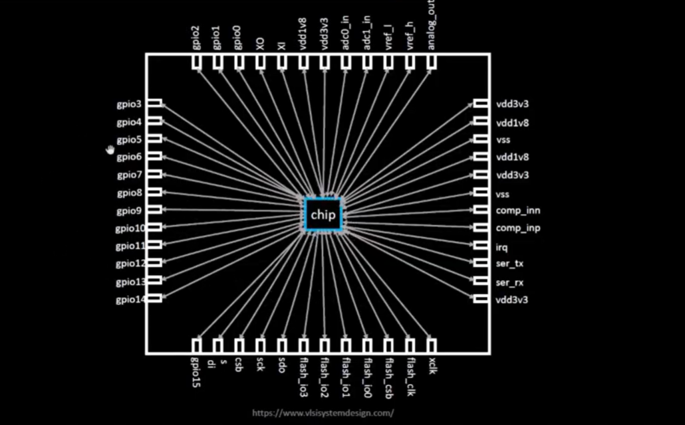
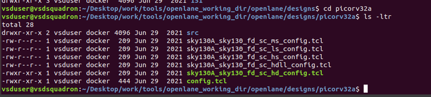

before publishing, find: openlane directory, pdks directory, designs & update accordingly

# video 0

## FPGA vs. ASIC
FPGA have reprogrammable logic while ASICs have permanently hardwired logic. FPGAs are more versatile, but have lower performance compared to asics. 
FPGAs are used for research & testing while ASICs are for finalized applications. Think of it like breadboards (representing FPGA) vs. PCBs (representing ASICs).

## Example: Arduino Board
heart of the board is a processor (A.K.A SoC): system on a chip (a single integrated circuit that combines all the components of a computer including processor, memory, and input/output)

    - this is not to be mixed with a CPU - SoC includes the CPU in itself
    - SoCs are for making smaller, more power efficient computing devices by compacting the computer 

A "package" - essentially everything connected to the chip inputs/outputs

## Foundry IPs
- PIL, adc, adc1, dac, SRAM
Macros
- RisCV SoC, SPI

# video 1 

RISC-V instruction set architecture (also known as "ISA")
1. compiled in assembly language program
2. implementation 
3. layout

# video 2 

apps run on hardware, how does that happen? computer abstraction: 
hardware => kernel => OS & apps

compiler converts c++ to binary code so the computer can understand. 

input & output of compiler 

terms: 
- register - a very fast, emall storage location within CPU used to hold instructions, addresses, data.

computer abstraction hierarchy: 
1. high level languages (python, java, C++) 
    - giving instructions in normal language 
2. compiler - converts high level code into lower level assembly or machine code. 
2. assembly language (human readable machine instructions)
    - a simpler more specific language that talks directly to a type of computer chip. Talking to the computer in basic commands it understands more direrctly e.g. "MOV A, B" 
    - then assembled into machine code
3. Machine code (binary)
    - the real instructions in 1s and 0s e.g. 1010010111
    - the computer's native language of just electrical signals on/off

Hardware side 
microarchitecture - the engine that does the work
    - how the computer chip is built to understand & run the machine code
    - parts inside CPU: how ALU (does math), registers (stores numbers) are wired together

Register Transfer Level (RTL) - design of data flow between parts
    - descibes how CPU components behave

logic gates -  100% digital circuits (AND, OR, NOT) 
    - it is made from a group of transistors connected in a specific pattern. 
    - when electricity flows into the gate, the transistors switch on/off in response to inputs, creating a logical output.

transistors - physical switches that form the logic gates.

# video 3 - SoC design using OpenLANE

## 3 parts of an asic:

1. RTL IP's 
2. EDA tools
3. PDK data (process design kit)

RTL IPs
    - reusable building blocks for designing computer chips 
    - like how lego pieces that help you build different structures, RTL IPs help build different parts of a chip (memory, processors, or controllers) 
    - RTL: a way to describe how data moves inside chip, IP: intellectural property, a tested block that can be reused. 
    - instead of designing a chip from scratch, engineers can use these ready-made blocks to save time and reduce mistakes. 
    - there are many open source RTL designs on the internet (github)  

EDA tools
    - software that help engineers design, test, and create chips. (arrange circuits basically)
    - e.g. you're desiggning a new car. design using software, test using simulations. EDA tools help engineers do the same, but for chips. 
    - popular software: Qflow, OpenROAD, OpenLANE

PDK (Process design kit) 
    - a blueprint provided by the factory that will make your chip; you need to make it a specific format so they can manufacture it. 
    - analogy: you're baking a cake using a new oven. The oven manual tells you the temperature settings. The PDK is the manual that tells chip designers how to design their chips so they can be correctly made by a specifci factory (called a foundry)
    

## Why Google & SkyWater Open-Sourced the PDK (SKY130)
Oven analogy
- designing a chip is like baking a cake in a special oven
- the PDK is the oven manual - it tells you how the oven works: temperatures, ingredients, timing etc. 
- For decades, the manual was locked away behind NDAs (Non disclosure agreements) so only big companies could access it. 

PDKs were traditionally locked behind NDAs because: 
1. the PDK reveals trade secrets. disclosing would give competitors a major edge
    - e.g. Apple will not open source its M1 chips because that would allow others to copy them and disrupt their revenue.  
2. foundries made money by selling access; they don't want to give that up
3. controlling access reduced liability from misuse

Why Skywater and Google open-sourced it (and did not face trouble) 
- they open sourced an older (130nm) process, so the risk of revealing "secrets" was low by industry standards. 
- SkyWater is a small U.S. foundry, and openness helps them stand out (it did after this collab)
- Google wanted to democratize chip design like open source software did for apps; helps with innovations. 
- this attracts community support, positioning themselves as the default choice for individuals prototyping chips 

GDSII (pronounced GDS-two) - graphic data system II
- the standard file format used to represent the physical layout of a microchip; the final blueprint sent to the factory for manufacturing.
- What the foundry uses to "print" the chip on silicon wafers.
- what's inside a GDSII file? 
    - shapes (polygons): define what layers of material where
    - layers
    - hierarchy: designs are reusable blocks

how are chips "printed" or manufactured?

# video 4

## RTL to GDSI flow

the journey from the idea (RTL) to the final blueprint for manufacturing (GDSII)

1. synthesis
    - Turning Blueprint Ideas into Real Parts
    - “Standard cells” are prefab building blocks: like a set of pre-approved building designs you can reuse (one for a hospital, one for a house, etc.).
2. floor/power planning
    - "Dividing Land for Different Uses"
    - planning where components go
3. placement
    - placing down the components
4. clock tree synthesis
    - synchronize all components with a central clock
    - builds a network of wires that spread the clock signal to all the parts that need it.
    - These parts are called sequential elements, and they must operate in sync with the same clock rhythm.
5. routing
    - lay down the wires to connect all components
6. sign off
    - check for quality
    - 2 types of physical checks: 
        1. DRC (Design Rule Check): "is this the most optimal design? where can we improve?"
        2. LVS (Layout vs Schematic): “Did we build exactly what the plan said?”

-------

# video 5: Open Source ASIC flow - OpenLANE

tougher to run when using open source EDA:
    - tools qualification? 
    - tools calibration? 
    - missing tools? 

## OPENLANE is a complete chip-building toolbox with all tools working together.
A tool that helps you automate the entire chip design process, from circuit design (RTL) all the way to the final layout (GDSII) that can be manufactured. 
1. full toolkit + instructions
2. open methodology
3. automation (can run full process with few commands)
    - give it a design and it goes through the flow

## striVe is a family of fully open source computer chip projects. 
striVe is a family open everything SoCs (system on chips): open PDK, Open EDA, Open RTL
striVe SoC family (what's the difference): 
1. strive - the first version proof of concept
2. strive 2 - more features
3. strive 2a - slight improvements 
4. strive 3 - more features
5. strive 5 - more stuff
6. strive 6 - more improvements

- The goal is to produce a clean GDSII with no human intervention (no human in the loop) 
- tuned for skywater 130nm Open PDK 
- containerized
    - functional out of the box
    - instructions to build and run natively will follow
- runs inside a docker container, so it works the same on every computer

Two Modes of Operation
1. Design Space Exploration: OpenLane can automatically test different configurations of your design.
    - Helps you find the best performance, area, and power tradeoff.

2. Large Number of Design Examples
    - Comes with 43 real chip designs, each with pre-tuned best configurations.

# video 6: tools inside openLANE

1. Yosys (synthesis): takes your verilog code and turns it into basic logic blocks that can be physically built. 
2. OpenROAD (placement, CTS, routing)
    1. placement - where to put each logic blocks
    2. clock tree synthesis (CTS) - system to send a clock signal everywhere
    3. routing - connecting everything with "wires" on different metal layers
3. Magic (layout & design rule check): checks your physical chip layout to make sure it follows all the manufacturing rules. allows you to Edit or visualize chip layout.
4. KLayout - GDSII viewer: lets you view the final GDSII file, which is the "photo ready" version of your chip sent to the factory.
5. Netgen (LVS: layout vs. schematic): checks if the layout your built still matches the original plan (your verilog design)
6. Fault (OpenSTA) : checks how fast signals travel inside the chip and whether they arrive on time at every destination. 

# video #7 - openlane directory structure in detail

    downloadOpenLane.pdf shows instructions on how to install the required EDA tools for this workshop. 
    when you're locked out the vm, the password is vsdiat

run this command at start to get things updated:

`sudo apt update -y && sudo apt upgrade -y`

# openlane directory

# pdks directory

# designs

You can view the default designs by openlane here

# video 8 - design preparation step

open openlane with `docker` command, then interactive mode with `./flow.tcl -interactive` in the new environment

you can view the config.tcl at `/Desktop/work/tools/openlane_working_dir/openlane/designs/picorv32a` using the command `less config.tcl` when in its directory. press q to exit. 
    - the config.tcl is used for... 
    

currently `/Desktop/work/tools/openlane_working_dir/openlane/designs/picorv32a` directory looks like this: 

We can begin design preparation. With the openlane interactive env open, run the design command `prep -design picorv32a`

after running this command, the picorv32a directory has a new directory "runs" created.

# video 9 - review files after design preparation, run synthesis

inside the runs folder there will be a directory with the date of creation, and in there would be 

1. a non-empty tmp folder containing the merged.lef file that was created from the prep openlane command.
2. a results folder containing results for each stage of the flow, organized by distinct folders.
3. a reports folder containing reports for each stage of the flow, organized by distinct folders. 

The directory is shown here

to run the synthesis (takes a minute): still in openlane interactive bash, run "run_synthesis" 
    - if successful, it will display "[info] synthesis was successful" 

# video 10 - openlane project github description

Online sources to learn more about openlane: 
- vlsi sysem design youtube channel
- search "openlane efabless" to find the github
- intro to skywater pdk: "fossi dial up" on youtube

in the "openlane efabless" github, there is comprehensive documentation on openlane software.
- need to run the commands as described in order or they might break

# video 11 - steps to characterize synthesis results

## 1. First task is to find the flop ratio

calculated by dividing cells of sky130_fd_sc_hd__dfxtp by total cells to find %

next, you can find the synthesized results in picorv32a.synthesis.v in results/synthesis folder.

directory

synthesis.v contents

you can find synthesized reports in /reports/synthesis 

reports contents

