Good floorplan vs bad floorplan and intro to library cells

// section: chip floor planning considerations

# video 12 (info) - utilization factor and aspect ratio.

1) define width and height of core and die
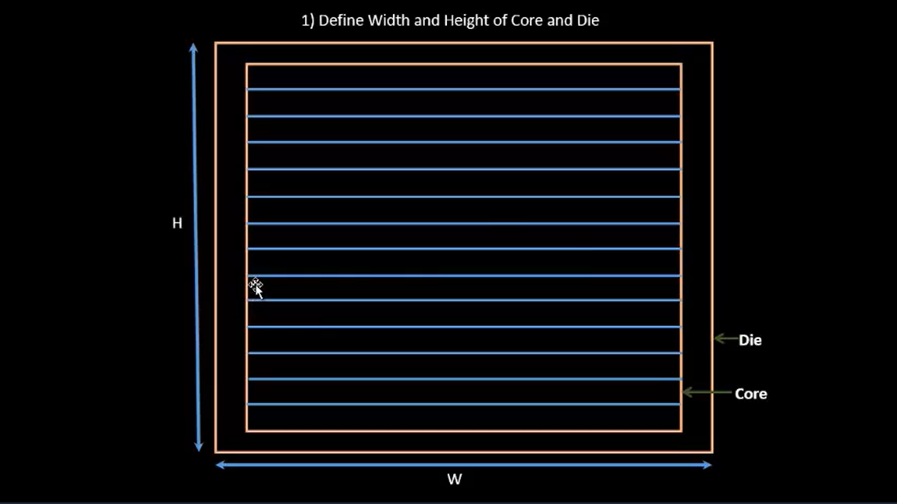

let's begin with netlist

flip flop 1 & 2 w/ simple combinational logic between them
a netlist defines the connectivity between components
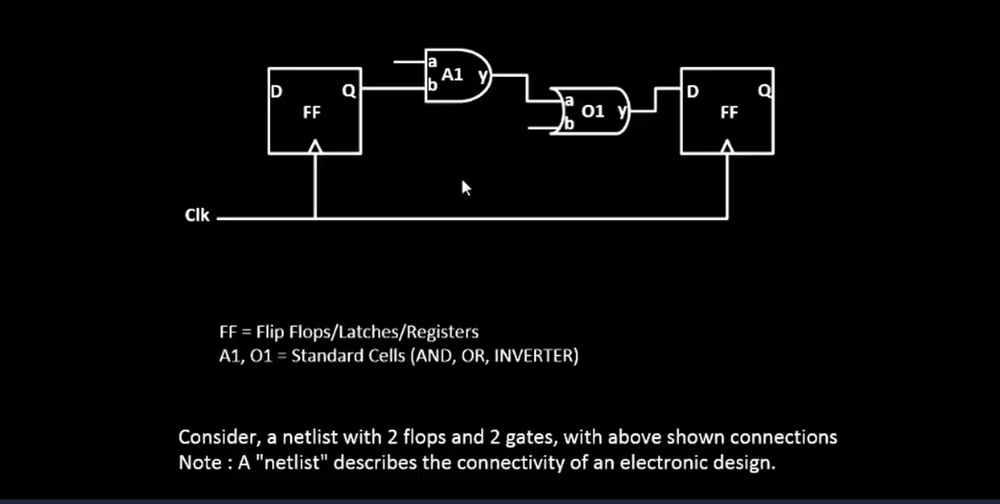

launch gate, and gate, or gate, flip flop
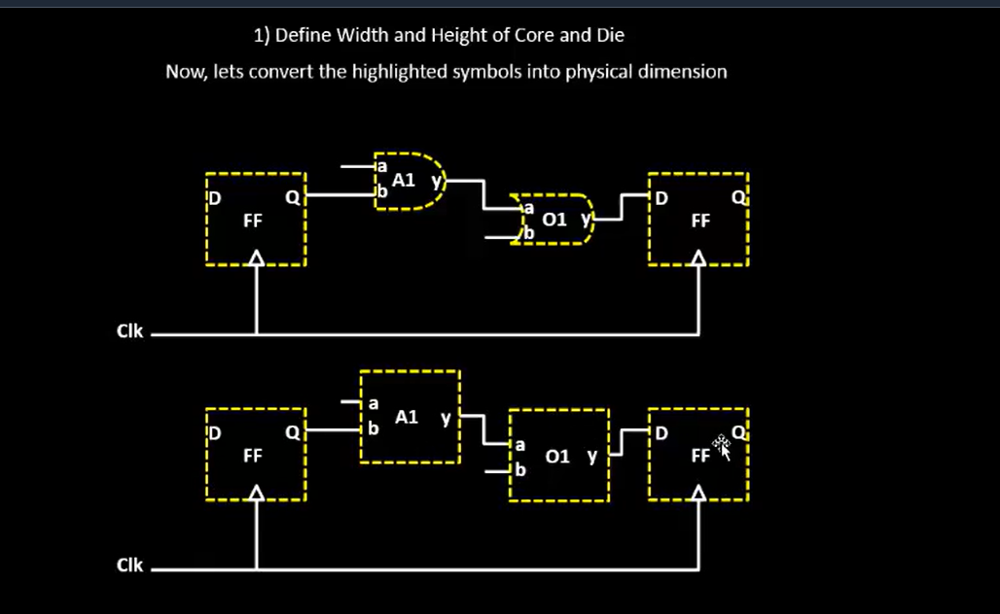

to find core and die, we are interested in finding the dimensions of the standard cells

core and die
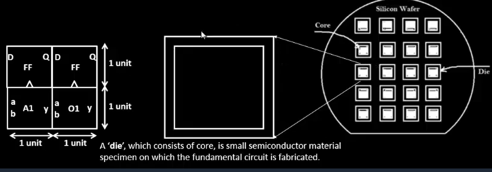

utilization percentage

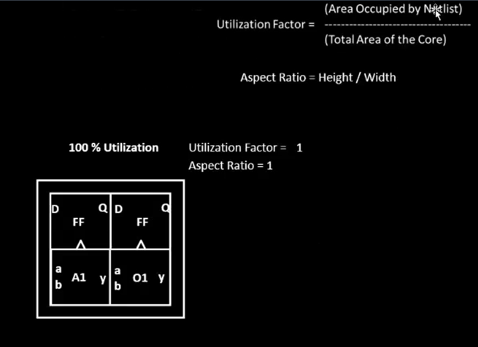

example calculation of utilization factor and aspect ratio 
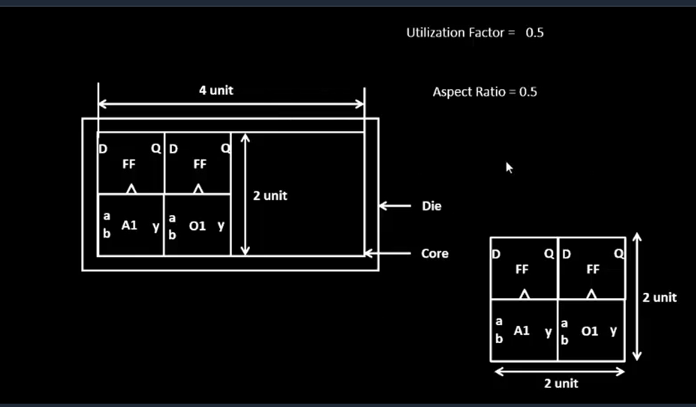

another example
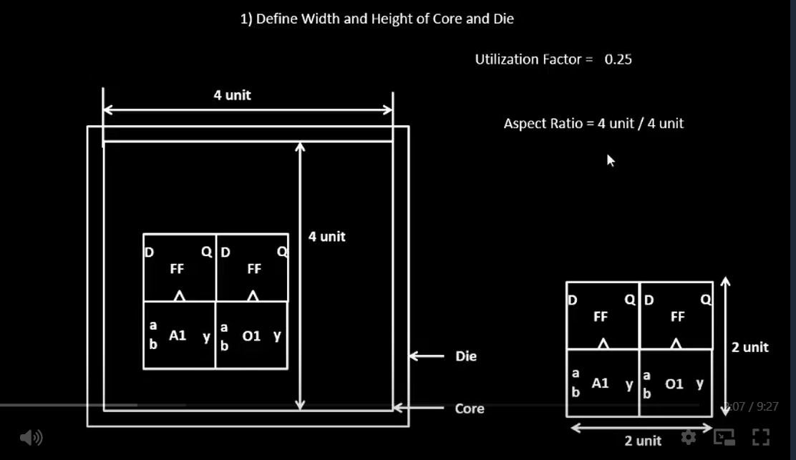

what is core and die?
what is significance of utilization factor and aspect ratio?

# video 13 (info) - concept of pre-placed cells

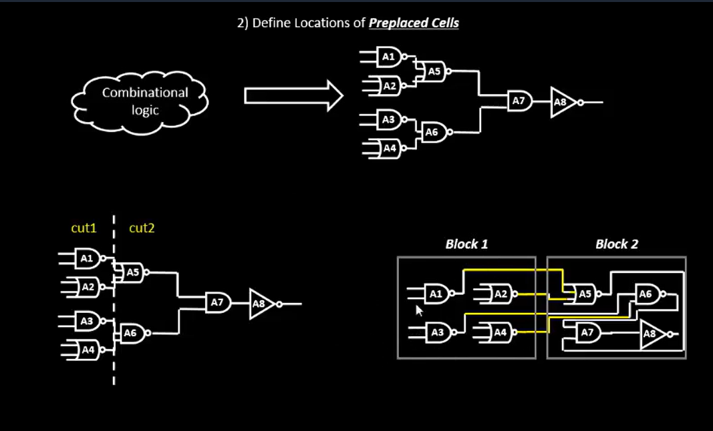

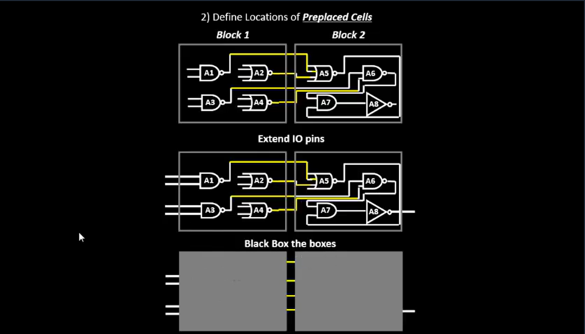

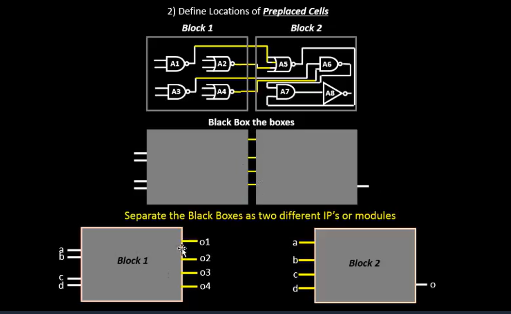

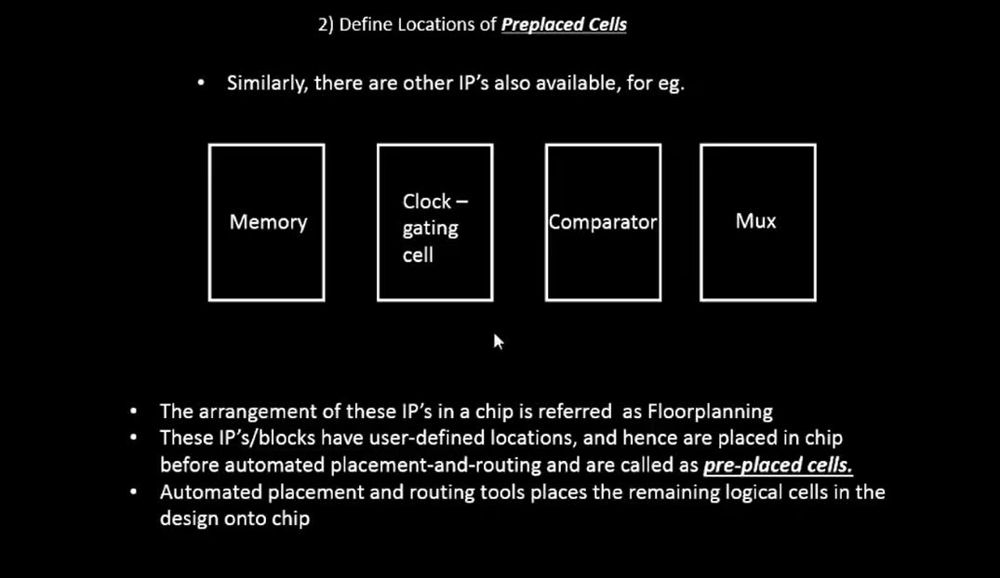

? did not understand

# video 14 (info) - decoupling capacitors

"we implement the blocks (preplaced cells) once and reuse it multiple times"

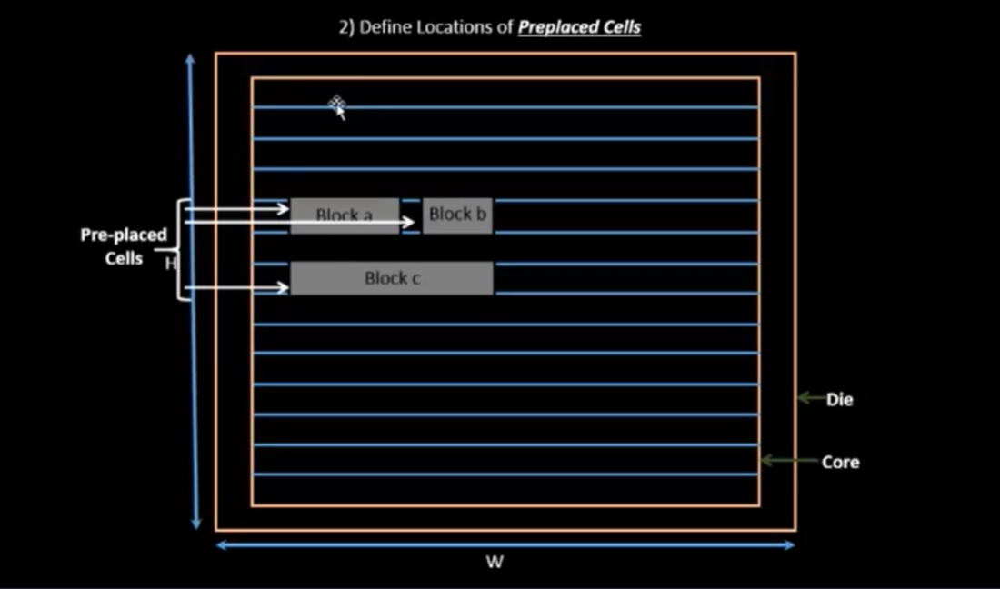

where to place the preplaced cells? 

what is decoupling capacitors? 
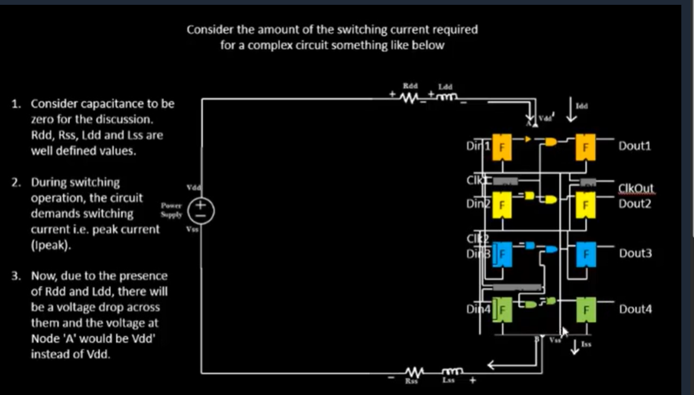

# video 15 (info)

# video 16 (info) 

# video 17 - steps to run floorplan using openLANE

# video 18 - review floorplan files and steps to view floorplan

# video 19 review floorplan layout in magic

// section: library binding and placement

# video 20 (info) 

# video 21 (info)

# video 22 (info)

# video 23 (info) 

# video 24 congestion awareplacement using "replace" 

// section: cell design and characterization flow

# video 25 (info)

# video 26 (info) 

# video 27  (info) 

# video 28 (info)

// section: general timing characterization parameters

# video 29 (info) 

# video 30 (info) 